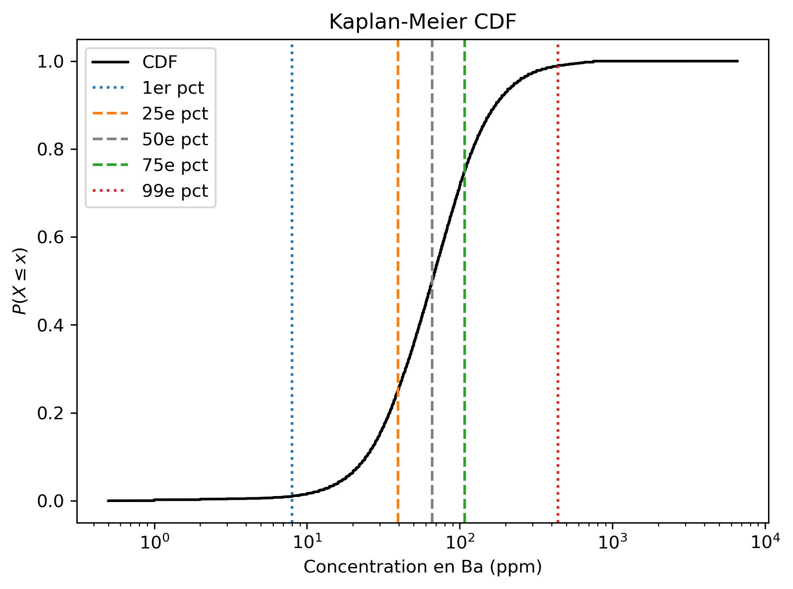

# kaplan-meier-geochemistry
Interface en ligne de commande pour la méthode de Kaplan-Meier appliquée aux données géochimiques.



## Packages nécessaires
Nécessite Python avec les librairies
- pandas
- numpy 
- matplotlib 
- lifelines
- tqdm

## Comment utiliser le script
1. Télécharger le répertoire GitHub vers un répertoire local
1. Ouvrir un terminal avec Python
1. Naviguer vers le répertoire local avec `cd chemin/vers/dossier"`
1. Utiliser la commande et ses différentes options :  
`python kaplan_meier.py "data/ba.csv" "Ba" --bootstrap 100 --impute --unit "ppm"`

## Aide pour le script
Entrez la commande `python kaplan_meier.py -h` pour imprimer l'aide :

```
usage: kaplan_meier.py [-h] [--unit UNIT] [--bootstrap BOOTSTRAP] [--impute] input_file element

Analyse géochimique avec Kaplan-Meier

positional arguments:
  input_file            Chemin vers le fichier CSV à traiter (ex: 'chemin/vers/csv_file.csv')
  element               Nom de la colonne de données à traiter (ex: 'Ba')

options:
  -h, --help            show this help message and exit
  --unit UNIT           Unité des analyses (défaut: 'ppm')
  --bootstrap BOOTSTRAP
                        Nombre de répétitions bootstrap (défaut: 1000)
  --impute              Effectuer l'imputation des valeurs censurées (défaut: Non)
```